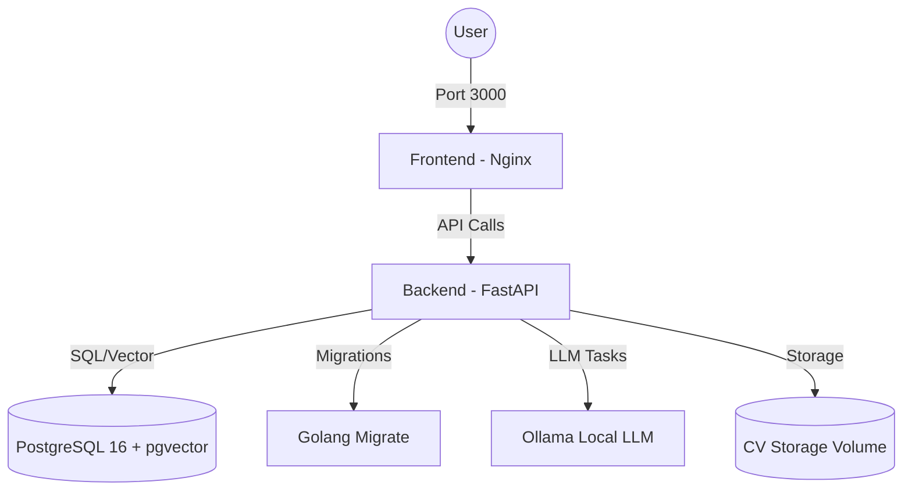
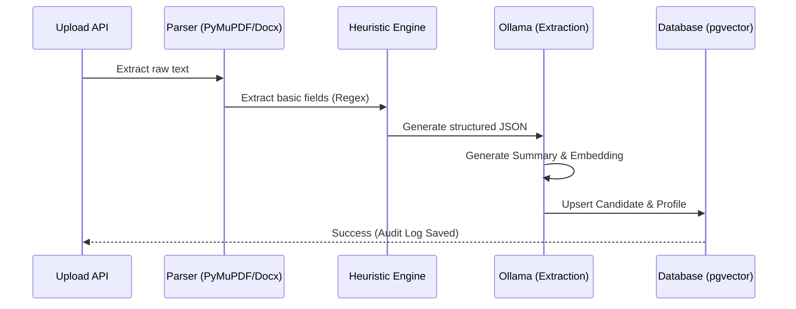

# Hellio-HR 🚀

Hellio-HR is a modern, agent-driven recruitment and HR platform designed to streamline candidate ingestion, profile enrichment, and intelligent search. By combining deterministic SQL queries with semantic vector search, Hellio-HR provides recruiters with a powerful, GDPR-compliant toolset for managing talent at scale.

---

## 📋 Table of Contents
- [Features](#-features)
- [System Architecture](#🏗️-system-architecture)
- [Tech Stack](#🛠️-tech-stack)
- [Getting Started](#🚀-getting-started)
- [Database Schema](#🗄️-database-schema)
- [API Endpoints](#🔌-api-endpoints)
- [CV Ingestion Pipeline](#📑-cv-ingestion-pipeline)
- [Development & Testing](#🧪-development--testing)
- [Configuration](#⚙️-configuration)
- [Agent System](#🤖-agent-system)
- [Constraints & Non-Goals](#⚖️-constraints--non-goals)

---

## ✨ Features

- **Unified Candidate Profiles**: Centralized storage for candidate data with versioned CV diffs.
- **Automated Ingestion**: Support for PDF and Word documents with automated extraction.
- **Intelligent Search**: Hybrid search combining deterministic SQL and semantic vector similarity (pgvector).
- **Agent-Assisted Workflows**: LLM-powered agents for summarization, extraction, and HR tasks with human-in-the-loop.
- **GDPR Compliance**: Full auditability of candidate data and LLM extraction costs/tokens.
- **Interactive Suggestions**: Semantic matching between candidates and open positions.

---

## 🏗️ System Architecture

Hellio-HR is built using a microservices-inspired architecture orchestrated via Docker Compose.



### Services
| Service | Image | Description | Port |
|---|---|---|---|
| `db` | `pgvector/pgvector:pg16` | PostgreSQL with vector extensions | 5432 |
| `migrate` | `migrate/migrate:v4.17.0` | Handles database schema migrations | N/A |
| `backend` | FastAPI (Python 3.11+) | Core logic, ingestion, and search API | 8000 |
| `frontend` | Nginx (Vanilla JS) | Static web interface | 3000 |

---

## 🛠️ Tech Stack

### Backend
- **Framework**: FastAPI (Uvicorn)
- **ORM**: SQLAlchemy 2.0
- **Validation**: Pydantic v2
- **Database**: PostgreSQL 16 + `pgvector` (768-dim embeddings)
- **NLP/LLM**: Ollama (`>=0.6.1`) for local inference
- **Parsing**: PyMuPDF (PDF), python-docx (Word)

### Frontend
- **Architecture**: Vanilla JavaScript (MVC pattern)
- **Server**: Nginx
- **Structure**: Modular JS (api, auth, data, models, views)

---

## 🚀 Getting Started

### Prerequisites
- Docker and Docker Compose
- Ollama (installed locally and running)

### Start the application

1. **Start the database**:
   ```bash
   docker compose up -d db
   ```

2. **Run migrations**:
   ```bash
   docker compose run --rm migrate
   ```

3. **Start all services**:
   ```bash
   docker compose up
   ```

4. **Access the platform**:
   - Frontend: [http://localhost:3000](http://localhost:3000)
   - Backend API Docs: [http://localhost:8000/docs](http://localhost:8000/docs)
   - **Default Credentials**: `admin@hellio.hr` / `admin123`

### Development Workflow
- Backend code changes auto-reload (uvicorn --reload)
- Frontend changes are immediate (volume mounted)
- Database data persists in Docker volume

### Useful commands

```bash
# View logs
docker compose logs -f backend

# Rebuild after dependency changes
docker compose build backend

# Reset database
docker compose down -v
docker compose up -d db
docker compose run --rm migrate

# Run migrations
docker compose run --rm migrate up

# Rollback last migration
docker compose run --rm migrate down 1
```

---

## 🗄️ Database Schema

### Core Tables
| Table | Description | Key Fields | Notes |
|---|---|---|---|
| `users` | System users/recruiters | `id`, `email (CITEXT)`, `password_hash` | Case-insensitive email |
| `roles` | RBAC roles | `id`, `name` | e.g., admin |
| `candidates` | Central candidate records | `id`, `name`, `email`, `embedding (Vector 768)` | pgvector column |
| `positions` | Job openings | `id`, `title`, `department`, `salary_min/max` | Job requirements and summary |
| `documents` | Uploaded CV files | `id`, `candidate_id`, `content_hash`, `display_name` | Deduplication via hash |
| `document_extractions` | LLM extraction audit trail | `id`, `document_id`, `llm_raw_output`, `cost_estimate_usd` | Full token tracking |
| `candidate_profiles` | Structured data | `id`, `candidate_id`, `profile_json` | JSON schema versioned |

---

## 🔌 API Endpoints

### Authentication (`/auth`)
| Method | Path | Description | Auth |
|---|---|---|---|
| `POST` | `/auth/login` | Returns Bearer token | None |
| `POST` | `/auth/logout` | Revokes current token | Bearer |

### Candidates (`/candidates`)
| Method | Path | Description | Auth |
|---|---|---|---|
| `GET` | `/candidates` | List candidates (optional `?status=` filter) | Bearer |
| `GET` | `/candidates/{id}` | Full profile, skills, experience, and summary | Bearer |
| `POST` | `/candidates/{id}/positions/{pid}` | Link candidate to position | Bearer |
| `DELETE` | `/candidates/{id}/positions/{pid}` | Unlink candidate from position | Bearer |

### Documents & Ingestion (`/documents`)
| Method | Path | Description | Auth |
|---|---|---|---|
| `POST` | `/documents/upload` | Upload CV (PDF/Word) - Async Ingestion | Bearer |
| `GET` | `/documents/{id}/download`| Retrieve original file | Bearer |

### AI & Chat (`/chat`)
| Method | Path | Description | Auth |
|---|---|---|---|
| `POST` | `/chat` | Natural language query (SQL/RAG/Hybrid) | Bearer |

---

## 📑 CV Ingestion Pipeline

When a document is uploaded, it passes through an asynchronous enrichment pipeline:



1. **Parse**: Raw text extraction from PDF or Word.
2. **Heuristics**: Fast rule-based extraction for common fields (name, email, phone).
3. **LLM Extraction**: Ollama generates validated JSON using `cv_extraction_v1` prompt.
4. **Deduplication**: Content-hash checking to prevent redundant processing.
5. **Summarization**: Generation of a human-readable profile summary (`cv_summary_v1`).
6. **Vectorization**: Creation of 768-dimension embeddings for semantic search.

---

## 🧪 Development & Testing

### Backend Testing
Backend tests are powered by `pytest` and located in `backend/test/`.
```bash
# Run backend tests
cd backend && pytest
```
- **Unit tests**: Covers schemas, prompts, and service logic.
- **Integration tests**: Full API flow validation (located in `backend/test/integration/`).

### Frontend Testing
E2E tests using Playwright.
```bash
# Run frontend tests
cd frontend/test && npm test
```

### Root Test Runner
Use the root script to execute the full suite:
```bash
./run-tests.sh
```

---

## ⚙️ Configuration

| Variable | Description | Default |
|---|---|---|
| `DATABASE_URL` | PostgreSQL connection string | `postgresql://...` |
| `SECRET_KEY` | JWT signing secret | Required |
| `CV_STORAGE_PATH` | CV file storage location | `/app/data/cvs` |
| `POSITIONS_ASSETS_PATH` | Seed data path for positions | Provided |
| `OLLAMA_BASE_URL` | Local Ollama endpoint | `http://host.docker.internal:11434` |

---

## 🤖 Agent System

Hellio-HR is designed to support autonomous agent workflows:
- **Stateless & Scalable**: Designed for AWS AgentCore or similar environments.
- **Human-in-the-Loop**: Agents suggest actions (e.g., candidate matching) but require human approval for external outputs.
- **Tool-Based**: Agents interact via the defined REST API rather than direct database manipulation.
- **Agent Roles**: Orchestrator, Research, Extraction, and Workflow Specialist.

---

## ⚖️ Constraints & Non-Goals
- **Privacy**: All candidate data is auditable to ensure GDPR compliance.
- **Cost Management**: LLM usage is tracked per extraction (tokens and estimated USD).
- **UI Focus**: The frontend is a functional tool for HR operators, not a consumer-facing application.
- **Streaming**: Chat responses are currently non-streaming (query-response).
- **Agents**: Agents do not write directly to the database.
